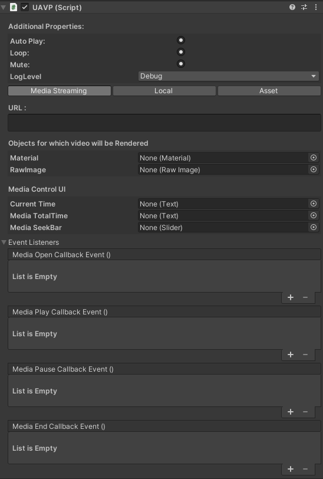
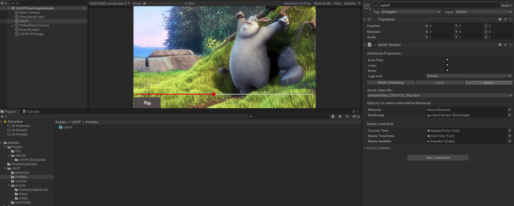

# UAVPlayer
UAVP(Unity Audio Video Player) is cross platform media SDK for unity that based on AVPlayer

<!--  -->

|Platforms|CPUs|Graphic API|
|------|---|---|
|OSX|x86, x86_64|Metal|
|iOS|armv7, arm64|Metal|

### Possibilities of UAVPlayer
- Video Playback(using Metal Graphic API, Unfortunately not supported OpenGL ES)
- Compaatible with Unity Editor(in-editor playback for OSX platforms only)
- Supported main video player events system: Open, Play, Paause, Ended
- Supported main video player features like: Play, Pause, Mute, Loop

# Usage
Using UAVP is very simple and easy

After the import the UAVP Package, There is UAVP Prefab(Asssets/UAVP/Prefabs). You should use UAVP Prefab in your project.

1. Additional Properties
   1. **Auto Play**: Start playback automatically after video is buffered
   2. **Loop**: When the playback reaches the end position it jumps to the start and plays again
   3. **Mute**: Set Audio Mute
2. Media Streaming / Local / Asset
   1. **Media Streaming**: Set Streaming Media Protocol
   2. **Local**: Set Local Video file
   3. **Asset**: Set video file which in Streaming Assets Directory
3. Material / RawImage
4. Media Control UI
   1. **Current Time**: Text Field to represent the current media time
   2. **Media TotalTime**: Text Field to represent the totaal media time
   3. **Media Seekbar**: Seekbar that can control the media
5. Event Listeners
   1. **Open Callback Event**: Callback Event when Media is Opened
   2. **Play Callback Event**: Callback Event when Media is Started
   3. **Pause Callback Event**: Callback Event when Media is Paused
   4. **End Callback Event**: Callback Event when Media reached the end
# Demo

# Download the Unity Package
[Download from Unity Asset Store](https://assetstore.unity.com/packages/slug/185282)
